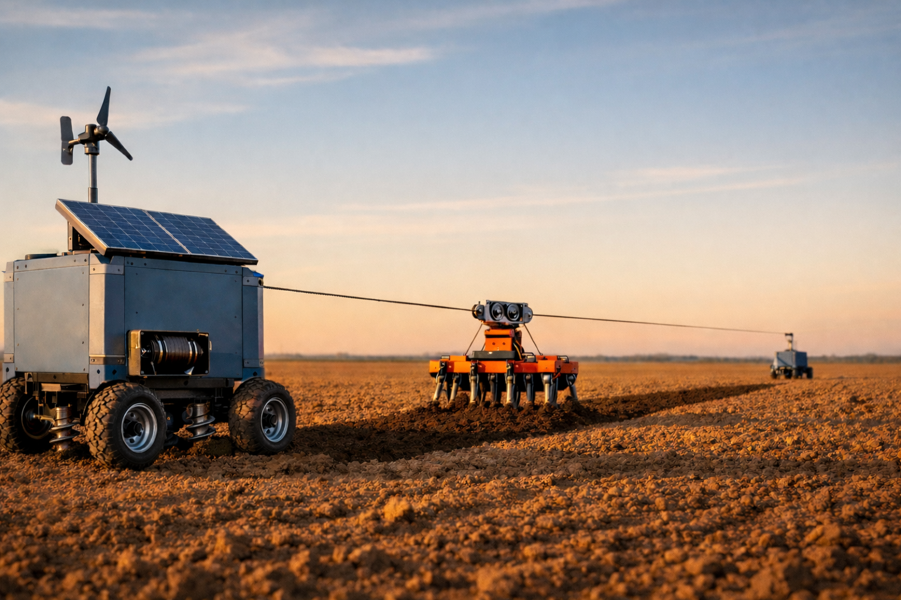

# CableTract

**A Co-Designed Cable-Driven Field Robot for Low-Compaction, Off-Grid Capable Agriculture — A Prototype-Free Feasibility Study**



[Read the paper (PDF)](manuscript/cabletract_manuscript.pdf) · [arXiv:2604.09938](https://arxiv.org/abs/2604.09938)

CableTract is a two-module cable-driven field robot concept in which a stationary Main Unit (winch, motor, battery, PV/wind harvester) and a lighter Anchor module (resisted by helical screw piles) hold a tensioned cable across a strip while a lightweight implement carriage rolls along it — so the heavy bodies stay on the headland and only the carriage enters the field. The carriage runs a 10-implement library *co-designed for the cable architecture* (narrower, shallower, slower, lighter than implements borrowed from conventional tractor inventories).

This repository contains the full analytical pipeline behind the manuscript: a catenary cable model, a decomposed drivetrain efficiency chain, an ASABE D497.7 stochastic draft model fitted to the co-designed library, an hourly TMY-based PV+wind+battery simulator on six bundled sites, a polygon strip-decomposition coverage planner on a 50-field corpus, a static contact-pressure compaction model, a discounted-cash-flow economics engine with battery replacement and life-cycle CO₂, and a Sobol global sensitivity analysis on 20 inputs. An (annual GHI × farm size) operating-envelope sweep and an architectural-variant comparison close the loop.

## Headline numbers (codesigned reference)

- **Energy:** 889 Wh/decare delivered electrical (the four-quadrant drive recovers ~3.5% on sloped fields; the conservative flat-field bound is 921 Wh/decare) — ~4× less *useful (drawbar)* energy and ~13× less *primary fuel* energy than an 80 hp diesel tractor (most of the larger factor is generic ICE→electric conversion efficiency, not the architecture)
- **Compaction:** ~98 % reduction in compacted area, ~73× reduction in the per-vehicle contact-pressure index (≈21× from p² × ≈3.5× from contact area; a running-gear property, not field-integrated)
- **Off-grid throughput:** 10–14 decares/day at six bundled sites (climate-conditional; annual energy-positive ≠ hourly autonomous)
- **Economics:** near-capex-parity with a used diesel tractor (€35,870 vs €35,000, incl. a €300 regen-capable drive). For a buyer **replacing** a tractor, NPV +€3,575 at 25 ha/yr, 8 % discount, 1.3 yr payback on the €870 increment; for an **additive** buyer financing the whole machine, NPV is negative until ~240 ha/yr.
- **Lifecycle CO₂:** 14.6 kg CO₂eq/ha/yr versus 32.5 for diesel — 2.2× improvement (operational, grid-independent)

## Repository layout

```
cabletract/         Python package (physics, soil, energy, layout, compaction,
                    economics, uncertainty, ml, variants, simulate, plotting, data/)
scripts/            Phase runners (run_phase1_physics.py … run_phase7_envelope.py)
tests/              Regression and unit tests for every phase
manuscript/         Compiled PDF of the manuscript
```

Each phase runner writes its figures and tables into local `figures/` and `tables/` folders on first run.

## Reproducing the manuscript

```bash
pip install -e .
python scripts/run_phase1_physics.py
python scripts/run_phase2_soil.py
python scripts/run_phase3_energy.py
python scripts/run_phase4_layout.py
python scripts/run_phase5_uncertainty.py
python scripts/run_phase6_ml.py
python scripts/run_phase6b_variants.py
python scripts/run_phase7_envelope.py
```

All input data (TMY summaries, ASABE D497 coefficients, helical pile capacities, cable mechanical properties, BOM CO₂ intensities, field polygon corpus) is bundled under `cabletract/data/` — no live API calls. The seven phase scripts regenerate every figure and table in the manuscript (with per-figure CSV companions written into `tables/`) from a clean checkout in under ten minutes on a laptop.

## Tests

```bash
pytest tests/
```

## Citation

Preprint: [arXiv:2604.09938](https://arxiv.org/abs/2604.09938)

```
@misc{yilmaz2026cabletract,
  title         = {CableTract: A Co-Designed Cable-Driven Field Robot for
                   Low-Compaction, Off-Grid Capable Agriculture --
                   A Prototype-Free Feasibility Study},
  author        = {Yilmaz, Ozgur},
  year          = {2026},
  eprint        = {2604.09938},
  archivePrefix = {arXiv},
  primaryClass  = {cs.RO},
  url           = {https://arxiv.org/abs/2604.09938}
}
```

## License

MIT — see `LICENSE`.
